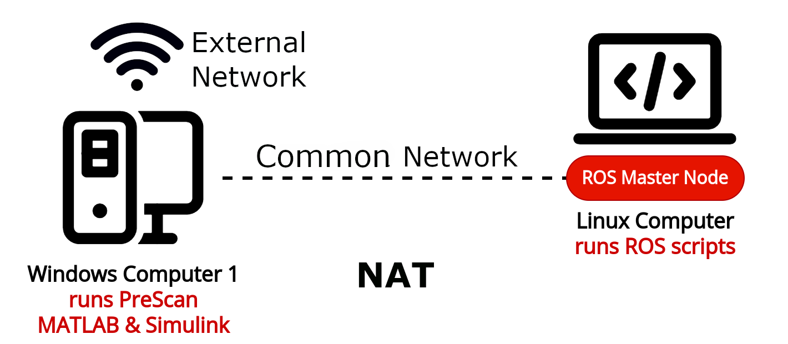
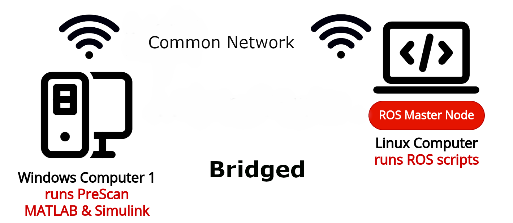
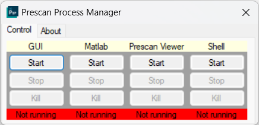
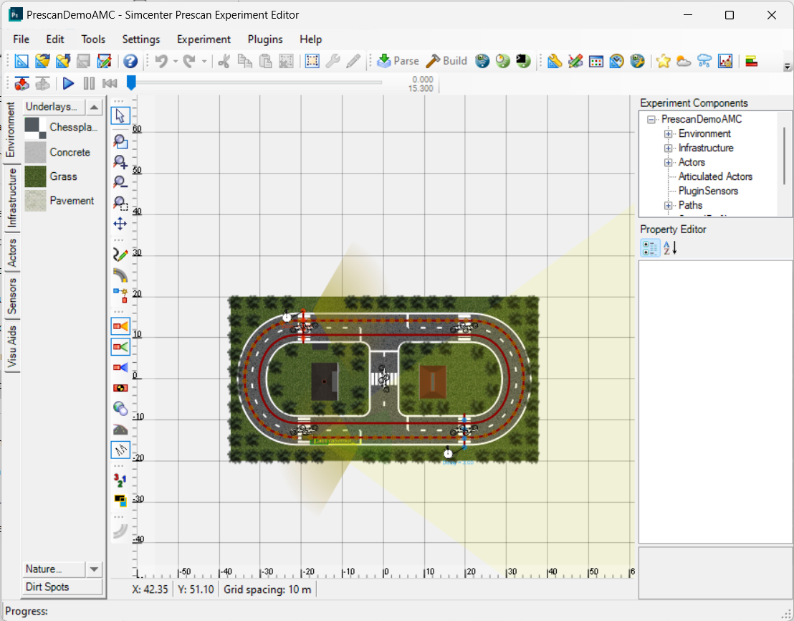

# F1tenth PreScan Project
Hosted at Eindhoven University of Technology's (TU/e) Autonomous Motion Control (AMC) lab, the **F1tenth PreScan** project bridges the gap between advanced simulation and real-world applications in autonomous vehicles.

### Authors

This project was created and is maintained by a group of people working for the Autonomous Motion Control (AMC) lab at the Eindhoven University of Technology. If you encounter any issues or have further questions, please contact one of the project's group members.

- **Giannis Badakis** (i.badakis@student.tue.nl)
- **Michalis Galanis** (m.galanis@student.tue.nl)
- **Adam Baversi** (a.bavarsi@student.tue.nl)

### Wiki Know-How

This document provides quick guidance on how to run this project. Refer to the following files for detailed information on specific components of the project.

- Refer to the wiki document [wiki ReadMe](docs/README.md) for detailed information on system architecture;
- Refer to the document [PreScan ReadMe](prescan/README.md) for detailed information on PreScan and the Simulink library;
- Refer to the document [ROS ReadMe](agent/README.md) for detailed information on the ROS configuration for the control of vehicle models.

## Requirements for Simulation

This simulation requires all the following components to be ready.

### Host (Computer)

The host is used to run the Prescan simulation environment

- Windows 11 Operating System
- Licensed Prescan 2302
    - Correct license number must be provided during installation
    - Configure environment variables in `Advanced Settings` of Windows
- Licensed MATLAB 2022b, with the following add-ons installed
    - Simulink
    - C compiler (must be installed through MATLAB add-on)
    - Aerospace Toolbox
    - ROS Toolbox
    - Simscape Electrical Toolbox
- *Optional*: dedicated graphic card (Intel 4090)

### Target (Computer or Virtual Machine)

The target is used to run the virtual models of the vehicles

- Linux 18.04 LTS
- ROS melodic
- Python 2.7
    - `numpy`

### Network Connection

The host and the target should be connected to a **common** network. The host and the target can be connected in a manner of either **NAT** or **bridged**:

- **NAT**: the host and the target are connected via an (internal) common network, while only the host is connected with the external network. If the target is a virtual machine, this is achieved by choosing **NAT** in the **network adapter** option.

- **Bridged**: both the host and the target are connected in the same common network. If the target is a virtual machine, this is achieved by choosing **bridged** in the **network adapter** option.

<p align="center">
  
  
</p>

The following information must be noted down:

- `hostip`: the IP address of the host in the **external network** (for **NAT** case) or in the **common network** (for **bridged** case);
- `targetip`: the IP address of the target in the **common network**;
- `targetname`: the name of the target.


## Quick Installation

### Target Side

#### 1. Install Linux system

You can configure the linux system from scratch by installing ROS and Python by hand. But we strongly suggest you directly use Linux image which is available at the `SymAware` sharing point.

- Open the `SymAware` sharing point at [https://tue.data.surfsara.nl/index.php/login](https://tue.data.surfsara.nl/index.php/login);
- Login using your credential;
- Navigate to `SymAware(Projectfolder)/WP5 Use Cases/PreScan Demonstrator`;
- Download the system image `Lubuntu_64-bit_f1tenth_26-04-2022.zip`;
- Install [VMware Workstation Player](https://www.vmware.com/products/workstation-player.html), no version required;
- Create a Lubuntu virtual machine by loading the virtual disk in `Lubuntu_64-bit_f1tenth_26-04-2022.zip`;


#### 2. Configure Linux system

- Turn on the Lubuntu system; The account and password of the system are both `student`;
- The system has pre-installed the correct versions of ROS and Python;
- Open terminal, type `nano ~/.bashrc`; This will open the configuration file `.bashrc`. Make sure it contains the following command:
```
source /opt/ros/melodic/setup.bash
```

#### 3. Note down network information


- Open terminal of Lubuntu, note down its name as `targetname`;
- Run `ifconfig`, note down the ip address of the virtual machine, i.e., the `targetip`. You might have multiple ip addresses. You must choose the one that is connected with the the host.
- Then, open the configuration file `~/.bashrc` as in step **2**, make sure it contains this command:
```
export ROS_MASTER_URI=http://targetip:11311
```
Here, you **MUST** replace `targetip` with the ip address that you just noted down. For easy configuration, you can directly set it as `localhost` which by default refers to the ip address of the local machine.

#### 4. Configure ROS package

- At the `home` directory `~/` of the Lubuntu system, create a new folder `~/catkin_ws` and a new subfolder `~/catkin_ws/src`;
- Copy paste the `agent` directory under folder `ROS/` of this repository to `~/catkin_ws/src/agent`;
- Navigate back to `~/catkin_ws`, in terminal, run `catkin_make` for a normal ROS compilation (Refer to ROS forums if you have problems in this step);
- After successful compilation, you need to open the configuration file `~/.bashrc` as in step **2** and **3**, again, to make sure it contains
```
source ~/catkin_ws/devel/setup.bash
```

#### 5. Last confirmation

Before finishing, make sure the following commands show up in `~/.bashrc`:
```
source /opt/ros/melodic/setup.bash
source ~/catkin_ws/devel/setup.bash
export ROS_MASTER_URI=http://targetip:11311
```
Order is not important.

### Host Side

#### 1. Configure Prescan and MATLAB

- Install **Prescan 2302** with a valid license;
- Remember to set environmental variables in Windows (consult with Siemens on details)
- Install **MATLAB 2022b** and the required add-ons.

#### 2. Register target in Windows

- Register the `targetip` and `targetname` in `C:\Windows\System32\drivers\etc\hosts`.

## Quick Run

To normally run the simulation, you **must** first run the ROS network on the target side, and then run MATLAB on the host side. When you terminate the simulation, you **must** take the conversed order, stop the MATLAB before killing the ROS network.

### Initialize the Host

- Open `Prescan Process Manager 2302`; The following dialog should shows up:
<p align="center">
  
</p>

#### Build the Prescan map

- In the panel of the manager, click `start` button under `GUI`; This will start Prescan GUI; This step will fail if you have not properly configured the Prescan license;
- In Prescan GUI, open the project file `prescan\examples\PrescanDemoAMC\PrescanDemoAMC.pex`, ignoring warnings, the following window should show up; Refer to Prescan manuals on how to custormize a map;
<p align="center">
  
</p>

- Click the `Parse` button to validate the environment; After successful parsing, click the `Build` button to build the project. This process should be performed each time you modify the map.

#### Configure the MATLAB script

- In the panel of the manager, click `start` button under `Matlab`; This will start MATLAB 2022b; This step will fail if you have not successfully install the correct version of MATLAB; Consult with Siemens if you have questions;
- For the first time you open MATLAB in this way, it may take several minutes for initialization; You will have errors if you lack necessary packages;
- It is always suggested to run MATLAB through Prescan manager, such that the Prescan libraries can be properly loaded;
- In MATLAB, navigate to `/prescan/examples/PrescanDemoAMC`, open the main script `main.m`, navigate to the following block, and modify the variables `target_name` and `host_ip` accordingly.
    ```
    %%%%%%%%%%%%%%% MODIFY HERE (START) %%%%%%%%%%%%%%%
    
    % set target linux computer name (client), as defined by the windows 'HOSTS' file
    target_name = 'XXX'; % MODIFY HERE, Remember to add this on the host's file
    
    % set the iP of this computer (host computer)
    host_ip = 'XXX.XXX.XXX.XXX';  % MODIFY HERE
    %%%%%%%%%%%%%%% MODIFY HERE (END) %%%%%%%%%%%%%%%
    ```


### Run Experiment: Target Side

- In terminal, run
    ```
    roslaunch agent agent.launch env:=sim safety:=true
    ```

    Optional arguments:
    
    - **`agent`:** the selected agent to launch (`idle`, `straight`, `random`, `pure_pursuit`). Default is `pure_pursuit`. Non-feedback agents are generally do not recommended to use, since they do not utilize waypoints and are only provided as a template for controller design.
    
    - **`safety`:** enables an elevated (prioritized) node that accounts for environment interactions such as pedestrians and traffic lights and 'filters' the action of the nominal agent (`true`, `false`). Default is `true`.

    - **`env`:** whether to run the real or a simulated environment (`sim`, `real_car`). Default is `real_car`.
    - **`car_id`:** the preferred F1TENTH vehicle to work with (`1`, `2`, `3`). This needs to match with the actual vehicle when running the experiment in a real environment. In simulation, this needs to match with the ROS topic names that are sent by MATLAB. Default is `3`.
    - **`offline`:** this flag enables the script to work independently from the windows computer. It internally 'simulates' all the necessary topics that would be otherwise sent by MATLAB. Since traffic lights and pedestrians are not internally modeled, this flag cannot be used when the safety flag is enabled.
    - **`rviz`:** this launches a pre-configured RViZ session for debugging. This flas is only available when used with a `sim` environment due to F1tenth's lack of a display. However, you can separately run this node in another local linux computer  as shown in step 4. Default is `true`.

### Run Experiment: Host Side
- Under directory `prescan\examples\PrescanDemoAMC`, run the `main.m` script, allowing the prompted folder changes. This should also start the Prescan Viewer. There might be a dialog prompting reminding the usage of integrated graphic card, for which you need to click it out. 
- Running the script may take several minutes to render and update models. Ultimately, the Prescan Viewer should start rendering the simulation; You will see a vehicle waiting in front of the red traffic light. After a while, when the traffic light turns green, the car will continue to move. The simulation looks like this:

    

### Debugging in ROS

- **Optional:** From another terminal, run an RViZ node for visualization purposes. A pre-configured RViZ file has been already created [here](/ROS/pure_pursuit/rviz/agent_real.rviz):
    ```
    rosrun rviz rviz -d rviz_config.rviz
    ```

    *Note*: this requires the Linux computer to export the `ROS_MASTER_URI` environment variable in order to match the IP address of the F1TENTH car. You can learn more [here](http://wiki.ros.org/ROS/EnvironmentVariables).

- **Optional:** Observe topics and messages:

    - Show list of available topics:
        ```
        rostopic list
        ```
    
    - Observe data stream of a specific topic:
        ```
        rostopic echo /topic_name
        ```

### Closing the simulation

To normally exit the simulation, you must **first** stop MATLAB simulation and **then** terminate ROS.

- On the host side, press `ESC` to escape from the Prescan viewer, and then press the stop button in MATLAB.

- On the target side, press `ctrl + C` in terminal to terminate the ROS server.

### Running the simulation again
- Follow above steps to first launch ROS in the target, and then run the MATLAB `main.m` script in the host. In most of the time, you can keep the ROS nodes alive without shutting them down every time.
