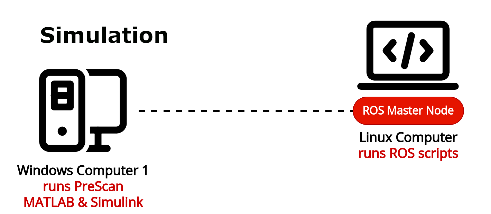

# F1tenth PreScan Project
Hosted at Eindhoven University of Technology's (TU/e) Autonomous Motion Control (AMC) lab, the **F1tenth PreScan** project bridges the gap between advanced simulation and real-world applications in autonomous vehicles.

# Introduction
The project seamlessly integrates the capabilities of PreScan ADAS (by Siemens) — a leading simulation platform for ADAS (Advanced Driver Assistance Systems) — with Simulink and the Robot Operating System (ROS) to effectively control an F1TENTH car system. Employing a modular ROS architecture, different control algorithms can be swapped allowing comparison between . Currently, a built-in version of the geometric path-following algorithm known as pure pursuit is implemented, in which the car interprets and follows waypoints to navigate its environment.


## About Prescan
PreScan offers engineers and researchers an environment to design and validate autonomous driving technologies without the initial need for real-world testing. It provides the capability to generate intricate traffic scenarios, capturing the complexity of real-world driving situations. For the F1tenth PreScan project, scenarios are inclusive of dynamic traffic elements like variable traffic light patterns and pedestrians at intersections.

## About the F1TENTH vehicle
The F1TENTH initiative aims to develop 1/10th scale autonomous racing cars tailored for research and teaching in autonomous driving. Utilizing the Robot Operating System (ROS) — a powerful collection of software libraries and tools adopted across academia and industry — the F1TENTH offers a realistic representation of larger autonomous vehicles.

## Integration and Communication
A crucial part of this project is the interface that integrates PreScan with the F1TENTH. A specialized Simulink system models the necessary experiment components of PreScan, with execution managed by MATLAB. The ROS Toolbox of MATLAB is essential in overseeing communication between PreScan and ROS. This project supports experiments with either a real F1TENTH vehicle or a simulated environment.

The general data flow is as follows:
- Static and dynamic data, including waypoints, are relayed from PreScan to MATLAB/Simulink.
- The ROS Toolbox facilitates data transmission to the F1TENTH car.
- Using the data, the car's pure pursuit agent (or any other agent) dictates the vehicle's desired velocity and steering actions.
- To reflect real world scenarios, a dedicated safety filter continuously monitors for potential dynamic objects in the environment, such as changing traffic lights or pedestrians, prompting the car to come to a halt when necessary.
- When using the real vehicle setup, a powerful motion capture system (VICON) precicely tracks the car's movements, which are subsequently fed back to the both the agent for new command and PreScan for updated simulation visualization.

Below, is an overview of the communication between the different system components, including ROS nodes, for real and simulated environments.

### Real Environment


### Simulated Enviroment


# System Requirements

In order to run this experiment, a set of hardware and software components are required.

## Hardware

A typical hardware setup for this project would consist of:
- **F1TENTH Vehicle System** (real environment only)
- **Windows Computer**: runs PreScan, MATLAB/Simulink (any environment) and VICON Tracker to capture data from VICON system and stream information to a ROS server ( real environment only).
- **Linux computer**: acts as either the ROS master node in case of simulated enviromnet, or as an SSH communication device in case of real environments.

In the diagram below, the AMC lab's configuration between the various systems is showcased for both the real and simulated environments. Keep in mind that a single windows workstation the two windows workstations can be merged the communication between the different systems are showcased. 

<p align="center">
  
  
</p>

## Software

To ensure a smooth experience for users and contributors, below are the supported versions for this project. Other versions should also work but are not tested in our configuration.

- Windows Computer(s):
    - PreScan (version 2302 or later).
    - MATLAB (version 2022b or later) with ROS Toolbox installed.
    - VICON Tracker (3.7 or later).
- Linux Computer:
    - Ubuntu (version 18.04).
    - Python 2.7 with Numpy installed.
    - ROS 1 (Melodic) with catkin workspace configured.
- F1TENTH Vehicle:
    - Ubuntu (version 18.04).
    - Python 2.7 with Numpy installed.
    - ROS 1 (Melodic) with catkin workspace configured.

# Installation

## Windows computer: Prescan & MATLAB/Simulink

For this project, it is assumed that the required official versions of PreScan ([link](https://plm.sw.siemens.com/en-US/simcenter/autonomous-vehicle-solutions/prescan/)) and MATLAB/Simulink ([link](https://www.mathworks.com/products/matlab.html)) have been installed.

In order to setup the Prescan experiment successfully, please follow the following instructions:

1. Extract the Prescan experiment folder (assumed to be created) into a directory of your choice. In case you want to create a new Prescan experiment, please follow the [Prescan guide](/docs/Getting%20Started%20with%20Prescan.pdf).

2. Copy the MATLAB/Simulink library files to the Prescan experiment folder. 

3. Configure your network connection settings by editing the MATLAB script `runExperiment.m`:

    a. Change the `target` variable with the appropriate host name of the computer that runs the ROS Master node.
   
        Note 1: It is recommended that the ROS Master node is executed at the same computer as the ROS agent node(s), i.e., car.
        
        Note 2: You need to add to the `hosts` file a unique host name of the computer runinng the ROS Master node with its appropriate IP. On the computer running the Prescan & MATLAB/Simulnk you can find the `hosts` file in `C:\Windows\System32\drivers\etc` folder.

    b. Change the `host_ip` variable with the Windows OS (computer running the Prescan and MATLAB/Simulink) IP.

## Linux computer & F1Tenth Car

On the linux side, ROS ([link](http://docs.ros.org/melodic/Installation/Ubuntu)) and Python are assumed to be installed successfully on both the Linux Computer and the F1TENTH vehicle.

The ROS package will need to be installed in the catkin workspace directory.

1. Navigate to your catkin workspace. Assuming your workspace name is the default (`catkin_ws`):
    ```
    $ cd ~/catkin_ws/src
    ```

2. Clone the project repository into your workspace using the command:
    ```
    $ git clone https://gitlab.tue.nl/aml/prescan-digital-twinning/f1tenth_prescan.git
    ```

    If you have a compressed archive of the source code instead, you can extract its contents in your catkin workspace directly.

3. Compile the ROS package using the following command:

    ```
    $ cd ..
    $ catkin_make
    ```

    In case of compilation errors, make sure to install the required ROS packages (dependencies) that are used within the ROS scripts.

4. Run the project experiments according to the next section.

# Usage

To execute the experiment, you will need to make sure that all the system components are up and running. Running the experiment, depending on the arguments, will either create a simulated environment or run the experiment on the actual car. In the experiment itself, a list of waypoints is provieded by Prescan and Matlab, that describe the path of a full lap in a custom predefined map created in Prescan. These waypoints can be used by the agents for trajecory tracking purposes.

## Windows computer: VICON

1. [Real environment only] Run the VICON Tracker software and make sure that the cameras are connected and ready to use. Perform a calibration sequence if necessary. 

   Note: Make sure that the car (object) has been selected for tracking within the VICON Tracker software.

## Windows computer: Prescan & MATLAB/Simulink

1. Run the `Prescan Process Manager 2302` executable with administrator privileges.
2. Start the Prescan GUI process from the Prescan Process Manager (see application tray on the Windows taskbar) 
3. Load the Prescan experiment file `"experiment-file-name".pex`.

    Note: In this step you can modify your experiemnt by adding/removing objects and/or (optionally) attaching speed profiles and paths designated for dynamic objects.

4. Build the Prescan experiment by clicking the `build` icon on the Prescan toolbar. This creates a simulink model with the essential initial blocks for each of the objects detected in the experiment.

    Note 1: Only cars with an `air-sensor` attached to its body are visible to the simulink model. This is expected, since an agent can interact with the environment within its sensors.

    Note 2: Only traffic lights with `enabled` lights are visible to the simulink model. This can be modified by right clicking the object and selecting `edit object configuration`. On the `lights` tab, check the options for each of the traffic light colors (`Red`, `Orange`, `Green`).

5. Start the MATLAB process from the Prescan Process Manager.

6. Navigate to the Prescan experiment folder and add the directory to the MATLAB path.

7. Run the MATLAB script `GenerateConfigurations.m` to generate two configuration files for traffic lights and vehicles. Feel free to modify the configuration files according to your needs. The two configuration files are:

    a. `TrafficLightConfiguration.xml`: This file contains all the programmable parameters of the traffic lights. The user can modify color cycle frequency and durations for each of the traffic lights seperately, allowing for more diversity.

    ```
    Note: Red and Green traffic light durations are specified in ratios (fractions of total duration) and they should sum to 1. In the current version, invalid values are not corrected. Orange duration is tunable but fixed regardless of total cycle duration, similar to most real scenarios.
    ```

    b. `VehicleConfiguration.xml`: This file contains all the programmable parameters for the vehicles present in the Prescan experiment. In this file, vehicles can be specified as `virtual` or `physical` (i.e. agent controlled by ROS). Both virtual and physical vehicles are attached with a path and speed profile defined in Prescan, however, in the case of physical car, the speed profile is ignored and is controlled by ROS scripts. Additionally, in case of a real environment, the user needs to specify the corresponding ID of the actual vehicle.

    ```
    Note 1: Make sure to set the vehicle ID parameter(s) to match the one(s) with the real car(s) of the lab in case you want specific cars of the experiment to be real. This is essential for the ROS topics to have the correct names. After modifying this parameter step 8 is required.
    ```

    ```
    Note 2: Make sure that you have set the boolean parameter virtual that corresponds to which car you associate as virtual or physical car. After modifying this parameter, step 8 is NOT required. In case of virtual `true`, vehicle ID is not taken into account.
    ```
    
    For more details, consult the [building process](images/prescan-steps.png) below.

8. Run the MATLAB script `UpdateModel.m`. This will update the simulink model and generate all the required blocks for communication with the ROS master node.

9. Run the MATLAB script `runExperiment.m` to start the experiment.

    Note: Make sure to run the corresponding ROS scripts at roughly the same time (preferably prior to the `runExperiment` script).
    
To showcase the capabilities of the project, a simple Prescan experiment has already been created representing a small city block (**usage step 3**). The designed map represents a scaled version (10:1) of the available driving area of the AMC lab. It additionally includes:

1. A passenger vehicle. This vehicle is intended to be controlled by a ROS agent, thus has to be `physical` (as defined in step 7).

2. Two passive pedestrians which are programmed to cross a crosswalk at specific time instances.

3. Two traffic lights programmed to cycle colors repeatedly with specific time frequencies.

In case of changes that need to be made to some aspects of the experiment, part of the steps will need to be executed again, depending on the nature of the change. For example, small changes such as switching between virtual and physical vehicles can be run ad hoc, while editing the prescan map requires re-building the entire model. The various use cases and corresponding building process are illustrated in the following diagram.


## Linux computer: ROS Experiment

1. [Real environment only] Connect to the F1TENTH car using SSH. 

    ```
    ssh username@address
    ```
    Usernames and ip addresses might vary depending on which car is used. For use in the AMC Lab, replace the `username` and `address` fields with the corresponding from the table below. Passwords are not shown for confidentiality reasons.
    
    | Car ID | Username | IP Address   |
    | ------ | -------- | ------------ |
    | 1      | student  | 10.128.7.108 |
    | 2      | student  | 10.128.7.110 |
    | 3      | f1tenth  | 10.128.7.131 |

    Note: IP addresses are subject to change due to dynamic IP. Please check IP address of the corresponding cars using the linux command `ifconfig`.

2. [Real environment only, **optional:**] If you have newer code version in the linux computer itself, update the car's code through the following command before going forward:
    ```
    scp -r source username@address:destination
    ```

3. Launch the ROS launch file. By default, the script will select the pure pursuit agent with a car id '3' which would expect the Car 3 to be operational if running the real environment.
    ```
    roslaunch agent agent.launch env:=sim safety:=true
    ```

    Optional arguments:
    - **`agent`:** the selected agent to launch (`idle`, `straight`, `random`, `pure_pursuit`). Default is `pure_pursuit`. Non-feedback agents are generally do not recommended to use, since they do not utilize waypoints and are only provided as a template for controller design.
    - **`safety`:** enables an elevated (prioritized) node that accounts for environment interactions such as pedestrians and traffic lights and 'filters' the action of the nominal agent (`true`, `false`). Default is `true`.
    - **`env`:** whether to run the real or a simulated environment (`sim`, `real_car`). Default is `real_car`.
    - **`car_id`:** the preferred F1TENTH vehicle to work with (`1`, `2`, `3`). This needs to match with the actual vehicle when running the experiment in a real environment. In simulation, this needs to match with the ROS topic names that are sent by MATLAB. Default is `3`.
    - **`offline`:** this flag enables the script to work independently from the windows computer. It internally 'simulates' all the necessary topics that would be otherwise sent by MATLAB. Since traffic lights and pedestrians are not internally modeled, this flag cannot be used when the safety flag is enabled.
    - **`rviz`:** this launches a pre-configured RViZ session for debugging. This flas is only available when used with a `sim` environment due to F1tenth's lack of a display. However, you can separately run this node in another local linux computer  as shown in step 4. Default is `true`.

4. **Optional:** From another terminal, run an RViZ node for visualization purposes. A pre-configured RViZ file has been already created [here](/agent/rviz/agent_real.rviz):
    ```
    rosrun rviz rviz -d rviz_config.rviz
    ```

    *Note*: this requires the Linux computer to export the `ROS_MASTER_URI` environment variable in order to match the IP address of the F1TENTH car. You can learn more [here](http://wiki.ros.org/ROS/EnvironmentVariables).

5. **Optional:** Observe topics and messages:

    - Show list of available topics:
        ```
        rostopic list
        ```
    
    - Observe data stream of a specific topic:
        ```
        rostopic echo /topic_name
        ```

# Authors

This project was created and is maintained by a group of people working for the Autonomous Motion Control (AMC) lab at the Eindhoven University of Technology.

- Giannis Badakis (i.badakis@student.tue.nl - johnbdks@gmail.com)
- Michalis Galanis (m.galanis@student.tue.nl - mgalanis98@hotmail.com)
- Adam Baversi (a.bavarsi@student.tue.nl - bavarsi.adem@gmail.com)

If you encounter any issues or have further questions, please contact one of the project's group members.
